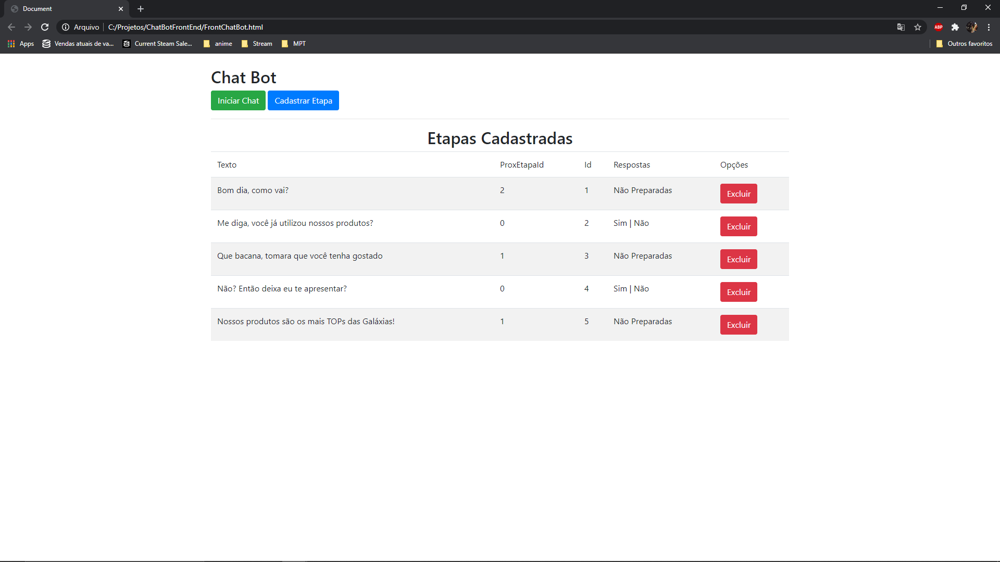
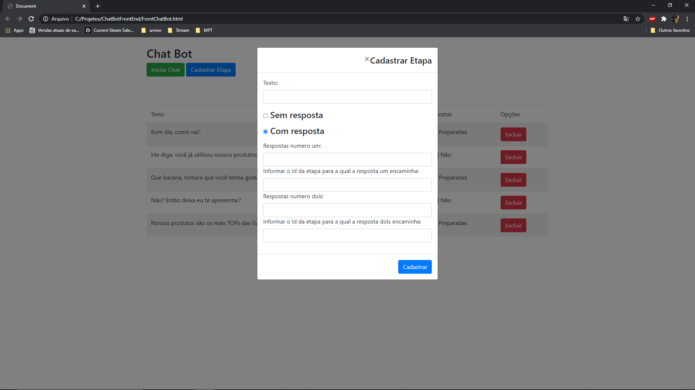
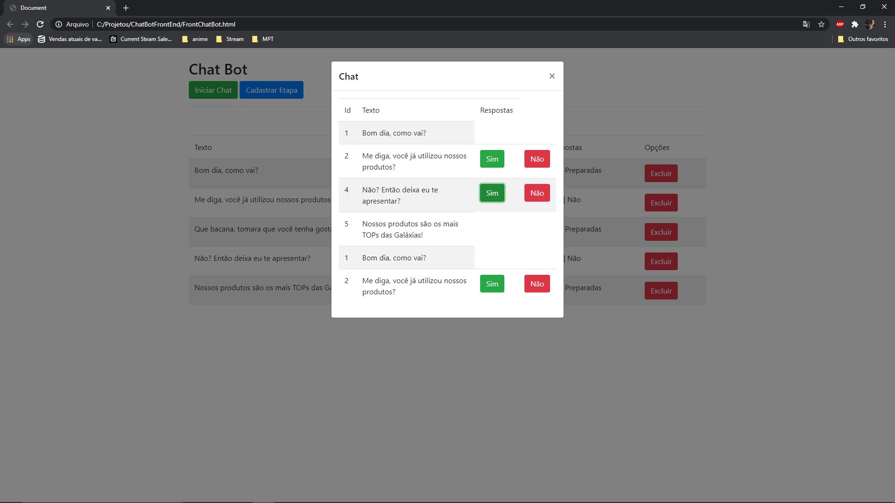

# ChatBotFrontEnd

Estes projeto é um client que consome a api: https://github.com/guialiveira/ChatBotApi
e simula a programação de um chat automatizado para atendimento genérico.
 
 
Lista etapas cadastradas:
 

  
Cadastro de frase e respostas para dialogo:
 

  
Simulandor de comportamento do chat:
  
  